<div align="center">



<a href="https://git.io/typing-svg"></a>

<p>
  <a href="https://github.com/JaganKSwain">
    
  </a>
</p>

<!-- Social Links -->
[](https://www.linkedin.com/in/jagan-kumar-swain/)
[](https://x.com/JaganKumarSwa10)
[](https://jagankswain.vercel.app/)
[](mailto:jagan.swain.ece.2024@nist.edu)
[](mailto:25f2007282@ds.study.iitm.ac.in)

</div>

---

### 🌱 About Me

```
🎓  B.Tech ECE @ NIST University (CGPA: 9.1) | BS Data Science @ IIT Madras (CGPA: 8.1)
🔬  Exploring Physics-Informed ML, Agentic AI Pipelines & Deep Learning.
🛠️  Building smart systems with Jetson, Arduino, Drones & Edge Computing.
🏆  Defence R&D Grant Recipient | SIH 2025 Grand Finalist | Best Innovation Award
⚡  From VLSI to Neural Nets — I enjoy the full stack of intelligent hardware.
🌿  Currently growing this digital garden, one commit at a time.
```

---

### 🛠️ Tech Stack & Skills

<div align="center">

**Languages**<br>


**AI & ML**<br>


**Hardware & IoT**<br>


**Tools & Platforms**<br>


**Core Domains**<br>


</div>

---

### 🚀 Featured Projects

<div align="center">

| Project | Domain | Highlights |
|---------|--------|------------|
| **🛡️ GuardX Sentinel** | CV, IoT, Drones | Drone-based human activity detection. **₹50K Defence R&D Grant** & **Best Innovation Award** |
| **♻️ SegroBin** | IoT, App Dev | Smart waste segregation — **SIH 2025 Grand Finalist (Top 5)** |
| **💓 DeepBeat** | Deep Learning | CNN-LSTM ECG arrhythmia classifier — **96% accuracy** on MIT-BIH |
| **🏎️ F1 Race Predictor** | ML, Time-Series | Race winner prediction — **95.6% cross-validated accuracy** |
| **🤖 AI Career Agent** | GenAI, Full-Stack | Agentic career guidance tool — **IndiaAI GenAI Hackathon (IISC × MeitY)** |
| **⚡ 16-Op ALU** | Verilog, VLSI | Full ALU with arithmetic, logic, shift & flags — verified in Vivado |

</div>

---

### 🏅 Achievements

<div align="center">

🏆 **₹50,000 Defence R&D Grant** — International Conference on Air Defence & Security<br>
🥇 **Best Innovation Award** — Chakravyuh 1.0 (GuardX Sentinel)<br>
🎯 **Grand Finalist** — Smart India Hackathon 2025 (Hardware Edition)<br>
🥇 **1st Place** — Web Development Competition, Festronix 2K26<br>
🏅 **Winner** — Code Crusade 4.0, NIST University<br>
☁️ **Google Cloud Skill Badge** — Vertex AI ML Solutions

</div>

---

### 🏆 GitHub Trophies

<p align="center">
  
</p>

---

### 📊 GitHub Stats

<div align="center">
  <picture>
    
  </picture>
  &nbsp;&nbsp;
  <picture>
    
  </picture>
</div>

<br>

<p align="center">
  
</p>

---

### 📈 Activity Graph

<p align="center">
  
</p>

---

### 💻 Weekly Coding Stats

<!--START_SECTION:waka-->


📅 **I'm Most Productive on Sunday** 

```text
Monday                   4 commits           █░░░░░░░░░░░░░░░░░░░░░░░░   03.92 % 
Tuesday                  9 commits           ██░░░░░░░░░░░░░░░░░░░░░░░   08.82 % 
Wednesday                7 commits           ██░░░░░░░░░░░░░░░░░░░░░░░   06.86 % 
Thursday                 12 commits          ███░░░░░░░░░░░░░░░░░░░░░░   11.76 % 
Friday                   10 commits          ██░░░░░░░░░░░░░░░░░░░░░░░   09.80 % 
Saturday                 3 commits           █░░░░░░░░░░░░░░░░░░░░░░░░   02.94 % 
Sunday                   57 commits          ██████████████░░░░░░░░░░░   55.88 % 
```


📊 **This Week I Spent My Time On** 

```text
💬 Programming Languages: 
Markdown                 53 mins             ████████████████░░░░░░░░░   65.99 % 
Python                   7 mins              ██░░░░░░░░░░░░░░░░░░░░░░░   09.62 % 
Git                      5 mins              ██░░░░░░░░░░░░░░░░░░░░░░░   07.23 % 
YAML                     5 mins              ██░░░░░░░░░░░░░░░░░░░░░░░   06.98 % 
Other                    4 mins              █░░░░░░░░░░░░░░░░░░░░░░░░   05.97 % 

🔥 Editors: 
Antigravity IDE          1 hr 21 mins        █████████████████████████   100.00 % 
```


 Last Updated on 20/07/2026 20:08:28 UTC
<!--END_SECTION:waka-->

---

### 🎧 Now Playing

[](https://spotify-github-profile.kittinanx.com/api/view?uid=31rulpew5ajcddhloaull4ip3sqi&redirect=true)

---

### 🐍 Contribution Snake

<picture>
  <source media="(prefers-color-scheme: dark)" srcset="https://raw.githubusercontent.com/JaganKSwain/JaganKSwain/output/dist/github-contribution-grid-snake-dark.svg">
  <source media="(prefers-color-scheme: light)" srcset="https://raw.githubusercontent.com/JaganKSwain/JaganKSwain/output/dist/github-contribution-grid-snake.svg">
  
</picture>

---

<div align="center">


<br><br>


</div>
